# ERD 수정본 (기능 명세서 기준)

> 기준: 기능 명세서 대주제 1~5 (**명세가 최신**)
> DB: PostgreSQL 16 / 테이블 18개

> **개정 안내 (2026-09-19).** 이 문서는 초기 설계(LoL 전용 · Discord 로그인 · 매칭 요청과 제안을 DB 에 저장 · 단일 스키마)의
> ERD 명세다. **여기 적힌 18개 테이블은 현재 스키마가 아니다.** 현재 결정과 부딪히는 자리를 표마다 "현재" 열로 적고 절마다
> `> 개정 이력:` 을 달았다. §4 의 ERD 본문(mermaid)은 옛 설계 그대로 두고 그 위에 테이블별 처분만 적었다 — **새 ERD 로 다시
> 그리지 않았다.** `platform` 이 소유할 테이블의 컬럼이 아직 정해지지 않았기 때문이다(../platform/CLAUDE.md §7).
> 위 "기준" 줄의 "명세가 최신"은 작성 당시의 말이다. 그 명세서도 같은 날 개정됐다.
>
> **DB 스키마의 현재 기준은 이 문서가 아니다.** 스키마 배치와 테이블 이름은 `docs/WHY_POSTGRESQL.md` §3 과
> `../platform/CLAUDE.md` §3.5, `matching` 이 읽는 `social.blocks` 의 모양은 `backend/src/main/java/com/queuemate/matching/block/Block.java`
> 와 `backend/src/test/resources/schema.sql` 이다. 출처 표기는 저장소 루트(`matching/`) 기준이다.

---

## 1. 이전 ERD에서 걷어낸 것

명세에 **명시적으로 "제공하지 않는다"** 고 적힌 기능들입니다. (작성 당시의 명세 기준이다 — "현재" 열을 함께 보라.)

| 삭제 대상 | 근거 (작성 당시) | 현재 (2026-09-19) |
|---|---|---|
| `party.status = RECRUITING` | 2.8 도입부 — 충원은 **제안 단계에서만**. 공개 빈자리 모집 없음 | **근거가 흔들린다.** 자동 매칭의 제안 단계에서 게시판으로 빈자리를 채우지 않는 것은 그대로지만, **파티 모집 게시판이 제품에 들어왔다** — 모집 글이 곧 파티방이다 (docs/11 D-11). 모집 중인 방의 상태를 어떻게 표현할지는 미정이다 (../platform/CLAUDE.md §7.1) |
| `party.status = COMPLETED`, `party.completed_at` | 5.5 도입부 — "파티 완료 기능이 없으므로" | **근거가 사라졌다.** 파티는 닫히고, 닫히면 `PartyClosed` 가 발행된다 (docs/11 #21). 어떤 컬럼으로 표현할지는 미정이다 |
| `party_member.left_at`, `leave_reason` | 1.7.14 나가기 미제공 / 1.7.16 구성원 변경 미제공 | **뒤집혔다.** 파티룸에 나가기가 있다 (docs/00 §5). 컬럼은 미정이다 |
| `seat_recruitment` (party에 매달린 형태) | 좌석은 `match_offer` 소속으로 이동 → `offer_seat` | 좌석 개념 자체가 없어졌다 (docs/11 #32·#33) |
| `party_rating` 테이블 | 명세에 평가 기능 없음 | 현재 결정에도 평가 기능은 없다 |
| `user_relation` 테이블 | 명세에 재회·차단 기능 없음 | **뒤집혔다.** 친구/차단/최근 함께한 사람/신고는 필수다 (docs/11 #13). `social` 스키마의 `friend_requests` `friendships` `blocks` `reports` `recent_players` 가 그 자리다 (../platform/CLAUDE.md §3.5) |
| `notification_job` 테이블 | `outbox_event` + `push_delivery`로 분리 (아래 참고) | 알림 작업을 DB 에 두지 않는다. 사용자 알림은 Redis Pub/Sub → SSE 다 (contracts/events.md) |

> 개정 이력: 2026-09-19 에 "현재" 열을 달았다. 예전 판은 앞의 두 열뿐이었고, 차단·나가기·파티 종료를 "명세가 제공하지 않으므로
> 걷어낸다"고 적었다.

---

## 2. 새로 넣은 것

| 추가 | 근거 (작성 당시) | 현재 (2026-09-19) |
|---|---|---|
| `game` 테이블 + 모든 곳에 `game_id` | 멀티게임 확장 최소 탈출구. 지금 비용 0, 나중에 넣으면 전체 마이그레이션 | 게임은 "확장 여지"가 아니라 **이미 셋**이다 — LoL · VALORANT · PUBG (docs/11 #8). 게임 모드 설정은 DB 테이블이 아니라 Redis `qm:gameconfig:*` 에서 읽는다 (CLAUDE.md §3, docs/GAME_CONFIG.md) |
| `offer_seat` / `offer_participant` | 1.6.11~1.6.19, 2.8 — 좌석 단위 + 충원 회차 | **폐기.** 좌석·충원 회차가 없다. 진행 중 제안과 수락 집계는 Redis 에만 있다 (docs/11 #27·#28) |
| `*_tier_order` 정수 컬럼 | 2.2.4 양방향 티어 판정. **문자열 비교는 틀립니다** (`'SILVER_1' < 'PLATINUM_4'` → false) | "티어를 순번으로 비교한다"는 생각은 그대로다. 다만 자리가 DB 컬럼이 아니라 **Redis ZSET `qm:gameconfig:{game}:tier` 의 score** 다 (CLAUDE.md §2, docs/11 D-8). 양방향 허용 범위는 없다 |
| `party.offer_id` UNIQUE | 1.6.25 — 한 제안에서 파티가 두 개 생기는 사고 차단 | 걱정은 그대로다 — `ProposalConfirmed` 는 at-least-once 라 같은 메시지가 두 번 와도 파티는 하나여야 한다 (../platform/CLAUDE.md §3.4). 무엇으로 막을지(컬럼·제약)는 미정이다 |
| `user_busy_interval`에 `EXCLUDE` 제약 | 1.4.17 — PK로는 "겹치는 구간"을 못 막습니다 | 기법은 그대로 유효하다 — INV-9 를 exclusion constraint 로 강제한다 (docs/WHY_POSTGRESQL.md §1-1, ../platform/CLAUDE.md §5). 대상은 예약이다 |
| `user_busy_interval.source_type` | 1.4.17은 **진행 중 요청**과 확정 파티 둘 다 점유해야 함 | **폐기.** 실시간 요청은 DB 에 없다 (docs/11 #27). INV-9 는 활성 예약끼리의 겹침이다 |
| `party_member.ready_state` | 1.7.7 참여 가능 / 1.7.8 늦을 예정 / 1.7.9 미응답 인원 | 파티룸에 Ready 가 있다는 것까지만 정해져 있다 (docs/00 §5). DB 컬럼인지 Redis 인지는 미정이다 (../platform/CLAUDE.md §7 "Redis의 다른 용도") |
| `outbox_event` | 1.9 — 파티 확정 트랜잭션 안에서 이벤트 적재 (확정↔알림 원자성) | outbox 패턴은 채택됐다. 다만 **스키마마다 따로** 두고(`matching.outbox` · `party.outbox` · `social.outbox`) 용도가 알림·Discord 가 아니라 `ProposalConfirmed` / `PartyClosed` 다 (docs/11 #21, docs/WHY_POSTGRESQL.md §2·§3) |
| `push_delivery` | 4.2.4 전송 성공 기록 / 4.2.5 실패 기록 / 4.4.6 실패 지표 | **폐기.** Web Push 가 없다. 알림 이력을 저장하지 않는다 (../notification/CLAUDE.md §2) |
| `reservation_batch_run` | 3.1.7 중복 실행 검증 / 3.5.6 실행 결과 기록 | "하루 1회" 전제가 사라졌다 — 배치는 1분 주기다 (docs/11 #23). 실행 결과는 메트릭과 deadman 감시로 본다 (docs/11 #24). DB 에도 남기는지는 문서에 없다 |
| `match_request.version` | 1.5.9 수정·취소 경합 (낙관적 락) | **폐기.** `match_request` 테이블이 없다. 경합은 Redis Lua 원자 실행으로 처리한다 (docs/11 #27, CLAUDE.md §4) |
| `app_user.discord_dm_enabled` | 5.4.1 / 5.4.2 기본값 꺼짐 | **폐기.** Discord 연동이 없다 |

> 개정 이력: 2026-09-19 에 "현재" 열을 달았다. 예전 판은 앞의 두 열뿐이었다.

---

## 3. 불변식 (INV) — DB 제약으로 강제

> **주의 — 이 표의 INV 번호는 프로젝트의 불변식 번호가 아니다.** 프로젝트의 불변식은 **INV-1 ~ INV-10** 이고 원본은
> `CLAUDE.md` §4 다. 번호가 같아도 내용이 다르다(예: 여기의 INV-6 은 "한 제안에서 파티 1개", 프로젝트의 INV-6 은 "차단 관계는
> 같은 파티 불가"). 다른 문서에서 "INV-n" 을 보면 **언제나 `CLAUDE.md` §4 의 번호**로 읽어라. 아래 ID 는 이 문서 안에서만 쓴다.

| ID (이 문서 한정) | 내용 | 구현 (옛 설계) | 명세 | 현재 (2026-09-19) |
|---|---|---|---|---|
| INV-1 | 사용자당 진행 중 요청 1건 | `match_request(user_id)` 부분 유니크 | 1.5.1 | 프로젝트 INV-1 과 같은 뜻이다. **DB 가 아니라 Redis Lua**(`claim-request.lua`)가 지킨다 (CLAUDE.md §4) |
| INV-2 | 사용자 시간 점유 비중복 | `EXCLUDE USING gist` | 1.4.17, 2.2.10, 3.2.9 | 프로젝트 INV-9(시간이 겹치는 활성 예약 금지)에 해당한다. exclusion constraint 기법은 유효하다. 실시간 요청은 점유 대상이 아니다 |
| INV-3 | 한 요청은 한 파티에만 | `party_member.request_id` PK | 3.5.4 | 프로젝트 INV-2 · INV-7 에 해당한다. Redis 에서 지킨다. 요청 id 는 Redis 에만 있는 값이라 DB 에서 FK 를 걸 수 없다 (docs/11 #27) |
| INV-4 | 파티 내 포지션 중복 금지 | `UNIQUE(party_id, position)` | 2.5.2 | 프로젝트 INV-8 의 일부다. 모드 설정(`positionUniqueness`)에 따라 Lua 가 지킨다. PUBG 는 중복 금지가 없다 (CLAUDE.md §4) |
| INV-5 | 이벤트 중복 발행 금지 | `outbox_event.event_id` UK | 1.9.9, 4.4.1 | outbox id 를 SQS `MessageDeduplicationId` 에 넣는다. 그래도 소비자는 멱등해야 한다 (docs/11 #21) |
| INV-6 | 한 제안에서 파티 1개 | `party.offer_id` UK | 1.6.25 | 요구는 그대로다(`ProposalConfirmed` 소비의 멱등성). 구현은 미정이다 (../platform/CLAUDE.md §3.4·§7) |
| INV-7 | 좌석당 활성 후보 1명 | `offer_participant(seat_id)` 부분 유니크 `WHERE response='PENDING'` | 2.8.14 | **폐기.** 좌석 개념이 없다 |
| INV-8 | 같은 제안에 같은 요청 재등장 금지 | `UNIQUE(offer_id, request_id)` | 2.8.4, 2.8.5 | **폐기.** 대체 충원 절차가 없다 |
| INV-9 | 자유 랭크 4인 차단 | `CHECK (queue<>'FLEX' OR target_size<>4)` | 1.4.8 | **폐기.** 금지된 인원은 그 modeKey 를 만들지 않는 것으로 배제한다 (docs/11 #31) |
| INV-10 | 예약 배치 하루 1회 | `reservation_batch_run.play_date` PK | 3.1.7, 3.4.3 | **폐기.** 배치는 1분 주기다 (docs/11 #23) |
| INV-11 | 파티당 Discord 채널 1개 | `party_discord_channel.party_id` PK | 5.6.7 | **폐기.** Discord 연동이 없다 |
| INV-12 | 같은 이벤트를 같은 구독에 1회만 | `UNIQUE(event_id, subscription_id)` | 4.4.1 | **폐기.** Web Push 가 없다 |

> 개정 이력: 2026-09-19 에 머리의 주의 문단과 "현재" 열을 달았다. 예전 판은 이 12개를 "DB 제약으로 강제하는 불변식"으로만
> 적었다. 지금은 실시간 매칭의 불변식을 DB 가 아니라 Redis Lua 가 지키고, DB 가 강제하는 것은 확정 이후와 예약·소셜 쪽이다
> (docs/WHY_POSTGRESQL.md §1 · §6). 프로젝트 INV-6(차단)에 해당하는 줄은 이 표에 없다 — 옛 설계가 차단을 제외했기 때문이다.

---

## 4. ERD

> **아래 그림은 옛 설계의 ERD 다. 본문을 고치지 않았고, 새 ERD 로 다시 그리지도 않았다** (`platform` 테이블의 컬럼이 미정이다).
> 같은 내용이 `03-schema.postgres.sql` · `04-erdcloud-import.sql` · `07-dbdiagram.dbml` · `05-erd.svg` · `06-erd.png` 에 있다.
> 테이블별 처분은 다음과 같다 (2026-09-19).
>
> | 옛 테이블 | 처분 | 근거 |
> |---|---|---|
> | `match_request` · `request_sub_position` | **폐기 — Redis 로 이동.** 실시간 요청은 Redis 에만 둔다. 부 포지션도 없다 | docs/11 #27, CLAUDE.md §2·§3 |
> | `match_offer` · `offer_seat` · `offer_participant` | **폐기 — Redis 로 이동.** 진행 중 제안·수락 집계는 Redis 다. 좌석·충원 회차가 없다. DB 에는 **확정된 것만** `matching.match_proposals` + `matching.proposal_members` 로 들어간다 | docs/11 #27·#28·#32·#33 |
> | `user_busy_interval` | **변경.** 실시간 요청은 점유 대상이 아니다. exclusion constraint 기법은 INV-9(활성 예약 겹침 금지)에 그대로 쓴다 | docs/WHY_POSTGRESQL.md §1-1 |
> | `app_user` | **변경.** PK 는 `bigint` 일련번호가 아니라 **가입할 때 정한 로그인 아이디(문자열)** 다. `discord_id` · `discord_username` · `discord_dm_enabled` 는 폐기. 자리는 `account.users` | ../platform/CLAUDE.md §3.5, docs/11 #16·D-4 |
> | `user_sub_position`, `app_user.primary_position` / `voice_mode` / `purpose` / `mood` | **미정.** LoL 전용 프로필이다. 게임이 셋인 지금 프로필을 어떻게 둘지 정해지지 않았다. 음성·목적의 값 집합은 바뀌었다(`REQUIRED`/`NO_VOICE`, `RANK_UP`/`TRYHARD`/`FUN` — `TRYHARD` 는 2026-09-29 에 `NORMAL` 을 바꾼 것, docs/11 D-49) | CLAUDE.md §2 |
> | `riot_account` | **변경·미정.** LoL(Riot) 전용이다. 지금은 게임 셋의 `account.game_accounts` 이고 외부 API 연동 범위는 미정이다 | ../platform/CLAUDE.md §3.5·§7 |
> | `push_subscription` · `push_delivery` | **폐기.** Web Push 가 없다. 알림은 SSE 하나이고 이력을 저장하지 않는다 | contracts/events.md, ../notification/CLAUDE.md §2 |
> | `party_discord_channel` · `party_discord_member` | **폐기.** Discord 연동이 없다. 파티 소통은 자체 WebRTC 다 | docs/11 #6·#25 |
> | `party` · `party_member` | **변경.** 자리는 `party.parties` · `party.party_members`. `offer_id` FK · `request_id` PK 는 성립하지 않는다(둘 다 Redis 에만 있는 id 다). `position` 은 LoL 전용이다. 나가기가 생겼다 | ../platform/CLAUDE.md §3.5, docs/11 #27, docs/00 §5 |
> | `outbox_event` | **변경.** 스키마별 outbox(`matching.outbox` · `party.outbox` · `social.outbox`)이고 topic 은 알림·Discord 가 아니라 SQS FIFO 큐다 | docs/11 #21 |
> | `reservation_batch_run` | **대응 없음.** 하루 1회 배치 전제가 사라졌다 | docs/11 #23·#24 |
> | `game` | **변경.** 게임은 셋으로 고정이고 모드 설정은 Redis gameconfig 다 | docs/11 #8, docs/GAME_CONFIG.md |
> | (그림에 없음) | **새로 필요한 것** — `account.credentials/refresh_tokens`, `social.friend_requests` · `friendships` · `blocks` · `reports` · `recent_players`, `reservation.reservations`. 컬럼은 미정이고, `social.blocks` 만 `matching` 이 읽는 모양이 정해져 있다(`id` 일련번호 PK · `blocker_id` 문자열 · `blocked_id` 문자열) | ../platform/CLAUDE.md §3.5 |
>
> 그림 전체가 **단일 스키마 · 테이블 간 FK** 전제다. 지금은 schema-per-service 이고 크로스 스키마 FK·JOIN 을 금지한다(docs/11 #17).

```mermaid
erDiagram
    game ||--o{ match_request : ""
    game ||--o{ match_offer : ""
    game ||--o{ party : ""

    app_user ||--o| riot_account : "1:1"
    app_user ||--o{ user_sub_position : "부 포지션"
    app_user ||--o{ push_subscription : "브라우저별"
    app_user ||--o{ match_request : "신청"
    app_user ||--o{ user_busy_interval : "시간 점유"
    app_user ||--o{ offer_participant : "응답"
    app_user ||--o| party_member : "참가"
    app_user ||--o{ party_discord_member : ""

    match_request ||--o{ request_sub_position : ""
    match_request ||--o{ offer_participant : "회차마다"
    match_request ||--o| party_member : "확정 시 1건 INV-3"
    match_request ||--o| user_busy_interval : "진행 중 점유"

    match_offer ||--|{ offer_seat : "정원만큼"
    match_offer ||--o| party : "전원 수락 시 1건 INV-6"
    offer_seat  ||--|{ offer_participant : "충원 회차"

    party ||--|{ party_member : "정원만큼"
    party ||--o{ user_busy_interval : "확정 점유"
    party ||--o| party_discord_channel : "확정 후 1건 INV-11"
    party ||--o{ party_discord_member : ""
    party ||--o{ outbox_event : ""

    outbox_event      ||--o{ push_delivery : ""
    push_subscription ||--o{ push_delivery : ""

    game {
        smallint id PK
        text code UK "LOL"
        text name
        boolean is_active
    }

    app_user {
        bigint id PK
        text discord_id UK "OAuth2 신원 - 1.1.1"
        text discord_username "확정 후 공개 - 1.7.4"
        text nickname "초기값 Discord 표시명 - 1.2.1"
        voice_mode voice_mode "필수 가능 사용안함 - 1.2.2"
        play_purpose purpose "1.2.3"
        play_mood mood "표시 전용 - 1.2.5"
        lol_position primary_position "1.2.6"
        boolean discord_dm_enabled "기본 false - 5.4.2"
        timestamptz created_at
        timestamptz updated_at
    }

    user_sub_position {
        bigint user_id PK "FK app_user"
        lol_position position PK "1.2.7"
    }

    riot_account {
        bigint user_id PK "FK app_user"
        text game_name "Riot ID 앞부분 - 1.3.1"
        text tag_line "Riot ID 태그"
        text puuid UK "account-v1 결과 - 1.3.3"
        text solo_tier "1.3.5"
        smallint solo_tier_order "비교용 정수"
        text solo_division
        int solo_lp
        int solo_wins
        int solo_losses
        boolean solo_in_placement "배치 진행 중 - 1.3.7"
        text flex_tier "1.3.6"
        smallint flex_tier_order
        text flex_division
        int flex_lp
        int flex_wins
        int flex_losses
        boolean flex_in_placement
        riot_link_status link_status "정상 확인필요 조회실패 - 1.3.8"
        timestamptz refreshed_at "마지막 갱신 - 1.3.9"
    }

    push_subscription {
        bigint id PK
        bigint user_id FK
        text endpoint UK "Web Push - 1.9.1"
        text p256dh
        text auth
        timestamptz created_at
        timestamptz revoked_at "410 Gone 감지 - 4.2.3"
    }

    match_request {
        bigint id PK
        bigint user_id FK
        smallint game_id FK
        match_kind kind "IMMEDIATE SCHEDULED - 1.4.1"
        queue_type queue "1.4.6"
        smallint target_size "1.4.7 INV-9"
        request_status status "1.5.2 부터 1.5.8"
        timestamptz requested_at "FCFS 1차 정렬키 - 2.4.1"
        int play_minutes "1.4.16"
        int max_wait_minutes "즉시 전용 - 1.4.2"
        date play_date "예약 전용 - 1.4.13"
        timestamptz window_start "시작 가능 범위 - 1.4.15"
        timestamptz window_end
        text tier_snapshot "1.4.19"
        smallint tier_snapshot_order "양방향 판정용 - 2.2.4"
        timestamptz tier_snapshot_at "신선도 - 1.3.11"
        smallint allowed_tier_min_order "1.4.10"
        smallint allowed_tier_max_order
        lol_position primary_position "2.5.1"
        play_purpose purpose "2.2.8"
        voice_mode voice_mode "2.3"
        jsonb conditions "게임 확장 여지"
        int version "낙관적 락 - 1.5.9"
        timestamptz created_at
        timestamptz updated_at
    }

    request_sub_position {
        bigint request_id PK "FK match_request"
        lol_position position PK "1.4.18 상관없음 전개 후"
    }

    user_busy_interval {
        bigint id PK
        bigint user_id FK "INV-2 EXCLUDE 대상"
        tstzrange during "겹침 금지 - 1.4.17"
        busy_source source_type "REQUEST 또는 PARTY"
        bigint request_id FK "둘 중 하나만"
        bigint party_id FK
    }

    match_offer {
        bigint id PK
        smallint game_id FK
        queue_type queue "2.7.5"
        smallint target_size
        play_purpose purpose "합의 조건 - 2.7.5"
        boolean voice_party "2.3.5 2.3.6"
        text combo_hash "중복 제안 방지"
        offer_status status "PENDING REFILLING CONFIRMED FAILED"
        timestamptz created_at
        timestamptz respond_by "최초 응답 만료 - 1.6.3 2.7.6"
        timestamptz refill_by "전체 충원 제한 - 1.6.21 2.7.7"
        timestamptz closed_at
    }

    offer_seat {
        bigint id PK
        bigint offer_id FK
        lol_position position "좌석은 포지션 단위 - 1.6.14"
        seat_status status "OPEN PENDING FILLED"
        bigint filled_by_request_id FK "수락 확정자 - 2.8.17"
        timestamptz opened_at
        timestamptz closed_at
    }

    offer_participant {
        bigint id PK
        bigint offer_id FK "INV-8"
        bigint seat_id FK "INV-7"
        bigint request_id FK
        bigint user_id FK
        smallint round "충원 회차 - 2.8.19"
        seat_response response "PENDING ACCEPTED_LOCKED DECLINED TIMED_OUT - 1.6.11"
        timestamptz offered_at
        timestamptz expires_at "1.6.8"
        timestamptz responded_at "조건부 전이로 멱등 - 1.6.9"
    }

    party {
        bigint id PK
        smallint game_id FK
        bigint offer_id UK "INV-6 예약은 NULL"
        queue_type queue "합의 스냅샷 - 1.7.6"
        smallint target_size
        play_purpose purpose
        boolean voice_party "1.7.5"
        timestamptz start_at "1.7.1 3.3.4"
        timestamptz end_at "start_at + play_minutes - 3.3.5"
        timestamptz confirmed_at "1.6.25"
    }

    party_member {
        bigint request_id PK "INV-3"
        bigint party_id FK "INV-4 UNIQUE party_id position"
        bigint user_id FK
        lol_position position "2.5.8"
        ready_state ready_state "NONE READY LATE - 1.7.7 1.7.8"
        timestamptz ready_at
        timestamptz joined_at
    }

    party_discord_channel {
        bigint party_id PK "INV-11 명령 멱등키"
        text guild_id "5.1.5"
        text category_id
        text channel_id UK "5.2.5"
        discord_channel_status status "REQUESTED CREATED SKIPPED FAILED DELETED"
        text fail_reason "권한부족 서버미가입 API장애 - 5.6.1"
        timestamptz created_at
        timestamptz delete_after "end_at + 24h - 5.5.1"
        timestamptz deleted_at "5.5.5"
    }

    party_discord_member {
        bigint party_id PK "FK party 채널 실패와 무관하게 기록"
        bigint user_id PK "FK app_user"
        discord_member_status status "PENDING GRANTED NOT_JOINED FAILED - 5.3.4"
        timestamptz granted_at
        text fail_reason "5.6.5"
        timestamptz updated_at
    }

    outbox_event {
        bigint id PK
        uuid event_id UK "INV-5 - 1.9.9"
        outbox_topic topic "NOTIFICATION 또는 DISCORD"
        text event_type "4.1.2"
        bigint party_id FK "nullable 실패 알림"
        bigint user_id FK "nullable"
        jsonb payload
        timestamptz available_at "리마인더 지연 - 4.3.11 부터 13"
        timestamptz published_at
        smallint attempts "4.4.2"
        text last_error
        timestamptz created_at
    }

    push_delivery {
        bigint id PK
        uuid event_id FK "INV-12"
        bigint subscription_id FK
        delivery_status status "SENT FAILED EXPIRED"
        smallint http_status "4.2.5"
        text error
        timestamptz sent_at "4.2.4"
    }

    reservation_batch_run {
        date play_date PK "INV-10 - 3.1.7"
        timestamptz started_at
        timestamptz cutoff_at "처리 경계 - 3.1.3"
        timestamptz finished_at
        int processed_count "3.5.6"
        int party_count
        int failed_count
        text error
    }
```

---

## 5. 상태 흐름

**이 절은 폐기됐다.** `match_request.status`(`RESERVED`/`QUEUED`/`PROPOSED`/`REFILLING`/`CONFIRMED`/`FAILED`/`CANCELED`)와
`offer_seat.status`(`PENDING`/`FILLED`/`OPEN`)는 둘 다 없어진 테이블의 상태다. 지금의 실시간 요청 상태
(`IDLE`/`QUEUED`/`PROPOSED`/`MATCHED`)는 Redis 에 있고(docs/03 §2, `domain/MatchRequestStatus.java`), 예약 상태는
`ACTIVE`/`PROPOSED`/`MATCHED`/`CANCELLED`/`EXPIRED`/`COMPLETED` 다(docs/04 §3). 같은 폴더의 기능 명세서 §6 에 고쳐 적었다.

---

## 6. Redis 담당 (Postgres에 없는 것)

**이 절은 폐기됐다.** 예전 판은 "Redis 가 통째로 날아가도 위 테이블로 복구 가능해야 한다"고 적고 대기열 Sorted Set · 선점 ·
대기 인원 카운터 · 멱등 키 · Riot 조회 락을 Redis 담당으로 꼽았다. 지금은 **정반대다** — Redis 가 진행 중인 실시간 매칭 상태의
원본이고, DB 로부터 재구축하지 않는다(docs/11 #27·#29). 현재 구조는 같은 폴더의 `매칭-Redis-요약.md` 와 `CLAUDE.md` §3·§4 를 보라.
