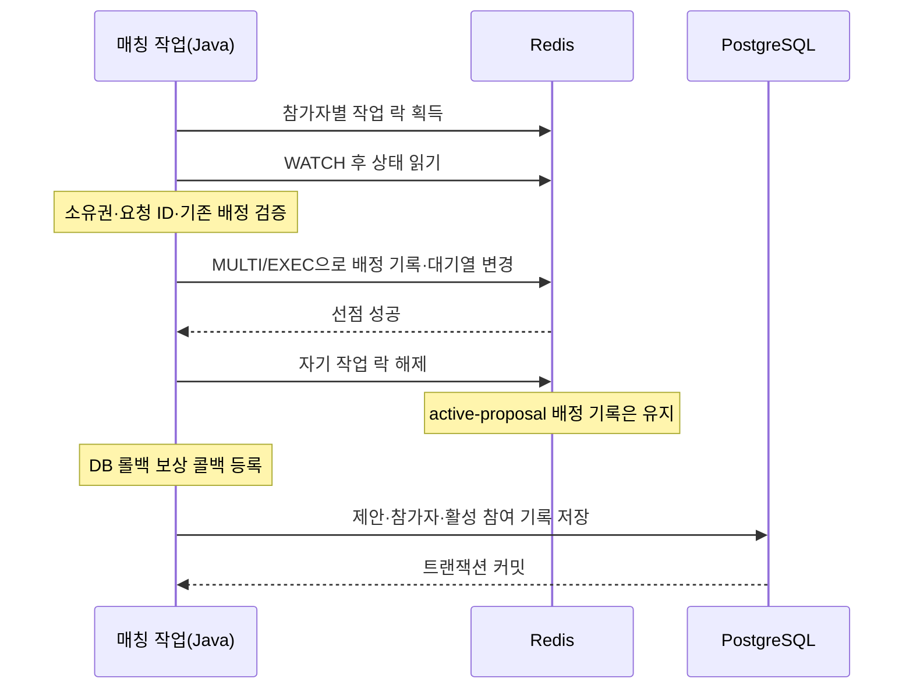

# 매칭의 원자성은 어디까지인가

**QueueMate · 매칭 엔진 — 락 만료, Redis 응답 유실, DB 롤백에 대응한 배정·복구 설계**

작성일: 2026-09-15

구현: Java 21 · Spring Boot 3.4.5 · Spring Data Redis/Lettuce · Redis 7 · PostgreSQL 16

조건에 맞는 참가자를 찾았다는 것과 그 참가자들의 배정을 저장했다는 것은 다른 성공이다.
QueueMate는 Redis에서 참가자를 선점한 뒤 PostgreSQL에 매칭 제안을 저장한다.
그 사이에 락이 만료되거나, 응답이 끊기거나, DB 트랜잭션이 실패할 수 있다.

이 설계에서 지키려는 기준은 두 가지였다. **확인하지 못한 배정을 성공으로 진행하지 않는 것,
그리고 이미 접수한 대기 요청을 복구할 근거를 남기는 것.** Redis 락 하나에 두 책임을 모두 맡길 수는 없었다.

이 문서는 운영 사고의 사후 보고서가 아니다. 현재 구현의 실패 경계를 분석하고,
실제 Redis·PostgreSQL을 사용하는 테스트에서 상태 변경과 예외를 주입해 검증한 기록이다.
복구 시간이나 장애 감소율을 측정하지 않은 항목에 개선 수치를 붙이지 않았다.

## 먼저 구분한 세 가지 성공

| 단계 | 성공의 의미 | 아직 보장하지 않는 것 |
|---|---|---|
| 요청 등록 | PostgreSQL에 대기 요청을 저장하고 Redis에 등록 | 조건에 맞는 참가자가 발견되거나 배정됐다는 보장 |
| Redis 선점 | 참가자별 배정 기록을 설정하고 실시간 대기열에서 제거 | PostgreSQL 제안 저장 성공 |
| DB 커밋 | 제안·참가자·활성 참여 기록을 영속화 | 모든 사용자의 수락과 최종 파티 확정 |

대기 등록이 커밋되면 `MatchTrigger`가 `ThreadPoolExecutor`로 매칭을 실행한다.
HTTP 등록 응답은 그 배정 작업의 완료를 기다리지 않는다. 따라서 등록 성공률만으로
매칭 엔진의 성공을 판정할 수 없다. 이 문서의 테스트는 Redis 키와 DB 행을 직접 확인한다.

또한 이 문서에서 말하는 **배정은 수락 전 매칭 제안(proposal)을 만드는 단계**다.
제안이 만들어졌다고 파티가 확정된 것은 아니다. 최종 확정에는 별도로 전원 수락이 필요하다.

## Lua에서 Java로 옮기며 정한 책임

기존에는 참가자 선점의 조건 확인과 Redis 변경을 Lua 안에서 처리했다.
현재는 업무 조건을 Java에서 탐색·수정·디버깅하기 위해 분산 락과 Java 검증으로 옮겼다.
이 전환을 성능 개선이라고 설명하지 않는다. 별도 비교 실험에서는 분산 락 대안의 성능 비용이 확인됐고,
유지보수성을 우선해 그 비용을 수용했다. 비교 대상은 당시 Lettuce 실험 구현이며 현재 제품 전체가 아니다.
[전환 판단](21_REDIS_CLAIM_LOCK.md), [전환 전 비교 기록](../harness/studies/redis-claim/RESULTS.md).

| 장치 | 맡긴 책임 |
|---|---|
| 참가자별 `SET NX PX` 락 | 같은 참가자의 선점 작업에 대한 동시 진입 제한 |
| `WATCH`와 Java 검증 | 락 소유권·활성 요청·기존 배정 확인, 검증 이후 변경 감지 |
| `MULTI/EXEC` | 관련 Redis 쓰기 명령을 다른 요청이 끼어들지 않게 실행 |
| PostgreSQL 트랜잭션·제약조건 | 제안과 참여 기록의 영속 저장, 중복 참여 저장 방어 |
| 롤백 보상·DB 기준 재구성 | Redis와 DB 사이에 남은 부분 상태 복구 |

**MULTI/EXEC은 Lua가 아닌 Redis 명령이다.** 실행 중 명령 오류까지 자동 롤백하는 기능은 아니며,
PostgreSQL 커밋도 포함하지 않는다. 이 한계 때문에 저장 전 조건 확인과 저장소 간 복구가 따로 필요하다.

정상 흐름은 다음과 같다. 짧은 작업 락과 수락 대기 동안 남는 배정 기록은 서로 다르다.



작업 락의 기본 임대는 10초, 제안 수락 제한은 기본 20초다. 서로 다른 목적의 시간이다.
DB의 대기 요청과 Redis 활성 요청을 60초 뒤에 버리는 구조는 아니다.
60초는 DB와 Redis를 대조하는 정합성 복구 작업의 기본 실행 간격이다.

## 1. 락을 획득한 작업도 저장 권한을 잃을 수 있다

### 문제와 원인

락에 임대를 두면 프로세스가 죽어도 잠금이 계속 남는 것을 피할 수 있다.
하지만 임대가 끝났다는 이유로 이미 실행 중인 Java 작업까지 멈추지는 않는다.

```text
A: 참가자 락 획득 → 상태 검증 → 실행 지연
Redis: A의 락 만료
B: 같은 참가자의 락 획득
A: 실행 재개 → 이전 검증 결과를 바탕으로 저장 시도
```

이때 필요한 질문은 “A가 한때 락을 잡았는가”가 아니라 “저장 직전까지 A의 검증이 유효한가”였다.
작업이 끝날 때 무조건 DEL하면 B가 새로 획득한 락을 지우는 문제도 생긴다.

### 선택한 처리

참가자 ID에 따라 락 키를 정렬하고, 실행마다 UUID 소유권 토큰을 부여한다.
락 획득 뒤에는 **락 키 자체도 WATCH 대상에 포함**한다.

검증 전에 임대가 끝났다면 읽어 온 소유권 토큰이 달라 거절한다.
검증 이후에 만료되거나 다른 작업이 키를 바꾸면 EXEC이 거절된다.
따라서 임대를 자동 연장하는 대신, 임대를 잃은 작업의 결과 저장을 중단하는 방식을 택했다.

해제는 짧은 Lua에서 토큰 비교와 삭제를 함께 수행한다.
Java로 선점 업무 로직을 옮겼지만, 이 작은 소유권 비교·삭제 연산은 원자적으로 유지했다.
일부 참가자의 락만 획득한 뒤 실패했을 때도 자기 소유의 락만 정리한다.

### 장애 주입과 확인 항목

`expiredHolderCannotCommitOrDeleteNewOwnersLock`에서 실제 EXEC 직전에
독립 Redis 연결로 락을 강제 만료시키고 `new-owner` 토큰을 저장한다.
10초 동안 실제 JVM을 정지시키는 방식이 아니라, 필요한 경합 순서를 결정적으로 만드는 테스트다.

확인하는 결과는 다음과 같다.

- 오래된 작업의 `claimAll()`은 false를 반환한다.
- 대상 참가자들에게 새 배정 기록이 만들어지지 않고 대기열 항목은 유지된다.
- 새 소유자의 락은 정리 코드에 의해 삭제되지 않는다.
- Redis 트랜잭션 충돌 지표가 기록된다.

같은 방식으로 검증 이후 활성 요청 ID가 교체되는 상황도 확인한다.
취소·재등록된 사용자의 옛 요청을 대상으로 선점하는 것을 막기 위한 검증이다.

근거: [분산 락 구현](../backend/src/main/java/com/queuemate/matching/infra/RedisClaimLock.java),
[Redis 트랜잭션 구현](../backend/src/main/java/com/queuemate/matching/infra/ProposalClaimRepository.java),
[경합 테스트](../backend/src/test/java/com/queuemate/matching/infra/ProposalDistributedLockTest.java).

## 2. Redis 선점 성공 뒤 DB가 롤백되면 대기열도 되돌려야 한다

### 문제와 원인

Redis 선점은 배정 기록을 남기면서 실시간 참가자를 대기열에서 제거한다.
그 뒤 PostgreSQL의 제안 저장이 실패하면 DB 트랜잭션은 되돌아가지만 Redis 변경은 자동으로 취소되지 않는다.

```text
Redis: 참가자 선점 성공, 대기열에서 제거
DB: 제안 저장 단계에서 트랜잭션 롤백
남은 상태: DB에는 대기 요청, Redis에는 배정 기록과 빠진 대기열 항목
```

작업 락을 해제하는 것만으로 해결되지 않는다. 사용자가 다시 후보에 포함되려면
배정 기록을 정리하고 대기열에 다시 넣어야 한다. 재등록 시각을 새로 찍으면 오래 기다린 사용자의
순서도 바뀌므로, 복구할 값에는 원래 대기 시각까지 포함했다.

### 선택한 처리

매처는 Redis 선점 성공 직후, DB 저장 전에 트랜잭션 완료 콜백을 등록한다.
DB가 커밋되지 않았다면 다음 보상 작업을 수행한다.

1. 현재 배정 기록이 자기 proposalId인 경우에만 삭제한다.
2. 실시간 참가자의 요청을 해당 버킷에 다시 넣는다.
3. 정렬 점수는 기존 `queuedAt`을 사용한다.

예약도 DB 롤백 시 자기 선점을 해제한다. 예약은 실시간 대기열과 같은 복귀 절차를 적용하는 대신
DB의 ACTIVE 상태를 바탕으로 다시 매칭할 수 있는지 확인한다.

DB에는 사용자별 `active_proposal_claims.user_id` 기본키도 둔다.
Redis와 DB가 어긋나 이미 참여 중인 사용자가 다시 선택되더라도,
두 번째 활성 참여 기록이 영속 저장되는 것을 막는 방어선이다.

### 장애 주입과 확인 항목

테스트는 실제 매처를 `TransactionTemplate` 안에서 실행해 선점과 제안 생성을 확인한 뒤,
`setRollbackOnly()`로 트랜잭션을 강제 롤백한다. DB 서버를 종료하거나 연결을 끊은 실험은 아니다.

실시간에서는 DB 제안·활성 참여 행이 남지 않고, Redis의 양쪽 참가자 선점이 해제되며,
대기열 점수가 각 요청의 원래 `queuedAt`과 같은지 확인한다. 이후 같은 요청으로 제안을 다시 만들 수 있어야 한다.
예약에서는 선점 해제, 활성 참여 행 부재, 예약의 ACTIVE 상태 복원, 재매칭 가능 여부를 확인한다.

근거: [실시간 보상 구현](../backend/src/main/java/com/queuemate/matching/app/RealtimeMatcher.java),
[실시간 롤백 테스트](../backend/src/test/java/com/queuemate/matching/RealtimeMatchingIntegrationTest.java),
[예약 롤백 테스트](../backend/src/test/java/com/queuemate/reservation/ReservationMatchingIntegrationTest.java).

### 보상 자체가 실패하는 경우

보상 시점에도 Redis가 죽어 있거나 프로세스가 종료되면 이 콜백만으로 즉시 복구할 수 없다.
그래서 PostgreSQL에 보존된 대기 요청을 기준으로 Redis 대기열을 재구성하는 작업이 별도로 있다.
잔여 배정 기록은 TTL로 정리되고, 기본 60초 간격의 reconciliation이 대기열과 활성 요청을 대조한다.

60초는 복구 완료 SLA가 아니다. 장애 지속시간, 작업 실행시간, 재탐색 시점이 추가될 수 있다.
이 보상은 Redis와 DB를 하나의 트랜잭션으로 묶는 기능이 아니라, 부분 상태를 뒤에서 복구하는 절차다.

## 3. 예외를 받았어도 Redis는 이미 저장했을 수 있다

### 문제와 원인

실행 전 실패와 응답 유실을 같은 것으로 취급하면 복구 판단을 잘못할 수 있다.

```text
상황 A: EXEC 실행 전 예외 → 아직 저장하지 않음
상황 B: EXEC 실행 완료 → 응답 유실 → 호출자는 예외를 받음
```

상황 B에서 호출자가 아는 것은 “성공 응답을 받지 못했다”는 사실뿐이다.
이를 “저장하지 않았다”로 단정해 임의로 배정을 진행하거나 기존 상태를 무조건 지우면 안 된다.

현재 매처는 `claimAll()`이 정상 성공한 뒤에 DB 롤백 보상 콜백을 등록한다.
따라서 EXEC 응답이 유실되어 `claimAll()`이 예외로 끝나면 그 보상 콜백도 아직 등록되지 않았다.
이 경계에는 다른 복구 근거가 필요했다.

### 선택한 처리

응답 유실 시 성공으로 간주하지 않고 예외를 전파해 이번 제안 생성을 중단한다.
Redis에 남아 있을 수 있는 배정 기록은 유한한 TTL을 가지며,
다음 선점은 기존 배정이 있는 동안 거절된다. DB에는 원래 QUEUED 요청이 남으므로
잔여 기록 만료와 정합성 복구 이후 다시 매칭할 근거가 유지된다.

반면 EXEC 전에 예외가 난 경우에는 DISCARD를 시도하고 자기 작업 락을 정리한다.
두 경우 모두 데이터 확인을 생략하는 재시도 경로는 만들지 않는다.

또 하나의 경계는 **성공 후 작업 락 해제 실패**다. 이 오류를 선점 실패로 바꾸면
실제로는 저장됐는데 호출자가 DB 저장·보상 등록을 진행하지 못한다.
따라서 이미 확인한 성공은 반환하고, 해제 실패는 로그·지표로 남긴 뒤 작업 락의 임대 만료에 맡긴다.

### 장애 주입과 확인 항목

`lostExecReplyFailsClosedEvenWhenRedisAppliedClaim`은 실제 Redis EXEC을 실행한 직후
클라이언트 래퍼에서 `RedisConnectionFailureException`을 발생시킨다.
실제 네트워크 패킷을 버리는 실험은 아니며, 저장 완료 뒤 호출자가 오류를 받는 상태를 재현한다.

테스트에서는 호출자가 예외를 받았어도 대상 사용자의 Redis 배정 기록에 해당 proposalId와
양수 TTL이 남는지, 독립 클라이언트의 경쟁 제안이 거절되는지 확인한다.
EXEC 전 예외 테스트에서는 쓰기가 남지 않고 같은 저장소로 다음 선점이 성공하는지 확인한다.
해제 실패 테스트에서는 선점 성공과 배정 기록이 유지되고 해제 실패 지표가 증가하는지 확인한다.

응답 유실 테스트 하나로 TTL 만료부터 최종 재매칭까지의 전체 자동 복구를 검증한 것은 아니다.
대기열 복원과 롤백 후 재매칭은 별도 통합 테스트로 확인한다. 이 경계를 합친 장시간 장애 실험은 추가 과제다.

근거: [선점·예외 처리](../backend/src/main/java/com/queuemate/matching/infra/ProposalClaimRepository.java),
[응답 유실·해제 실패 테스트](../backend/src/test/java/com/queuemate/matching/infra/ProposalDistributedLockTest.java).

## 검증 결과와 재현 방법

이번 재검증의 제품 코드 기준은 `fd70bbef59c3647e12529eff3f0fcb9e35e5a081`이다.
기존 사용자 작업 트리 변경은 유지했고, 이 문서 작업에서 제품 코드나 테스트 구현은 변경하지 않았다.
Redis `redis:7-alpine`, PostgreSQL `postgres:16-alpine` Testcontainers를 사용한다.
분산 락 테스트의 독립 클라이언트는 **한 JVM 안의 두 Lettuce 연결 팩토리**다.
40개 동시 시도에서 실시간과 예약이 같은 참가자를 경쟁하도록 한다. 여러 실제 앱 서버를 띄운 시험은 아니다.

| 검증 묶음 | 확인 범위 | 이번 실행 |
|---|---|---|
| `ProposalDistributedLockTest` 9개 | 동시 선점, 부분 락, 만료, 요청 교체, EXEC 전후 오류, 해제 실패, 입력 검증 | 통과 |
| 실시간 롤백 테스트 1개 | DB 롤백 후 선점 해제·원래 대기 순서·재매칭 | 통과 |
| 예약 롤백 테스트 1개 | DB 롤백 후 ACTIVE 상태·선점 해제·재매칭 | 통과 |
| `MatchQueueRecoveryIntegrationTest` 5개 | Redis 초기화 후 복원, 정상 상태, 대기 순서, 낡은 guard 정리·정상 guard 보존 | 통과 |

**2026-09-15 재실행: 16개 통과, 실패 0개, 오류 0개, 건너뜀 0개.**
Gradle 작업은 `BUILD SUCCESSFUL`로 종료했고 `bootJar`는 기존 산출물이 최신 상태임을 확인했다.

테스트에서는 함수 반환뿐 아니라 사용자별 Redis 배정 키, 작업 락 토큰,
대기열 ZSET 점수, DB 활성 참여 행과 요청 상태를 확인한다.
40개 경쟁 시도는 성공이 정확히 하나이고, 선택되지 않은 동료들은 배정되지 않아야 통과한다.

저장소 루트에서 다음과 같이 재현한다. Java 21과 Docker가 필요하다.

```bash
cd backend
./gradlew test \
  --tests 'com.queuemate.matching.infra.ProposalDistributedLockTest' \
  --tests 'com.queuemate.matching.RealtimeMatchingIntegrationTest.rollbackAfterClaimRestoresQueueAndAllowsRetry' \
  --tests 'com.queuemate.reservation.ReservationMatchingIntegrationTest.rollbackAfterClaimReleasesReservationParticipants' \
  --tests 'com.queuemate.matching.MatchQueueRecoveryIntegrationTest' \
  bootJar
```

이번 실행은 컨텍스트 종료 지연을 줄이기 위한 임시 Gradle init 파일도 사용했다.
`Test` 작업에 `spring.lifecycle.timeout-per-shutdown-phase=1s`,
`spring.test.context.cache.maxSize=1`을 전달했고, 제품 설정과 테스트 기대값은 바꾸지 않았다.
클래스별 결과·테스트 이름과 대상 소스의 SHA-256은
[검증 기록](evidence/matching-atomicity-2026-09-15.json)에 보존했다.
JUnit 결과는 `backend/build/test-results/test/TEST-*.xml`, HTML 보고서는
`backend/build/reports/tests/test/index.html`에 생성된다. 다음 테스트 실행 시 덮어써지는 로컬 산출물이다.

## 관측과 남은 한계

선점 결과는 `qm.matching.claim.duration`의 `source=realtime|reservation`,
`outcome=success|conflict|error`로 구분한다. 락 경쟁, Redis 트랜잭션 충돌,
락 해제 실패, 세션 정리 실패는 각각 별도 지표를 남긴다.
여기서 선점 success는 전체 DB 커밋이나 사용자 수락 성공 지표가 아니다.
관측하는 단계가 다르면 이름이 비슷한 성공률도 서로 다른 값을 의미한다.

남아 있는 범위도 명확하다.

- Sentinel은 master 교체를 담당하지만, 비동기 복제에서 락·배정 기록 유실 가능성은 남는다.
  WATCH는 서로 다른 master의 상태를 하나로 묶어 주지 않는다. DB 제약조건을 유지하는 이유다.
- Redis 런타임 명령 오류는 MULTI/EXEC이 자동 롤백하지 않는다.
  코드가 큐 타입을 미리 확인해도 관리자의 동시 타입 변경 등 모든 상태 훼손까지 제거하지는 못한다.
- DB 보상 콜백 실행 전에 프로세스가 죽거나 보상이 실패하면 즉시 복구되지 않는다.
  주기 복원에 의존하는 구간의 사용자 대기시간은 별도 실측이 필요하다.
- 이 문서의 통과 결과는 선택한 16개 테스트의 결과다. 전체 회귀 테스트, 운영 최대 처리량,
  Sentinel 장애 중 종단 간 무손실, WebSocket 도착률을 검증한 결과로 확대하지 않는다.
- 비동기 처리 중 장애·지연을 사용자에게 별도로 알리는 기능과 인메모리 재시도 큐는 현재 구현하지 않았다.

이 설계에서 원자성은 하나의 거대한 보장이 아니다.
**락 소유권이 유효한지, Redis 변경이 실행됐는지, DB가 커밋됐는지를 각각 판단하고,
경계에서 실패했을 때 남는 상태를 복구하도록 책임을 나눴다.**
관련 명령의 의미와 구현 세부는 [분산 락 선점 설계](21_REDIS_CLAIM_LOCK.md)에 정리되어 있다.
